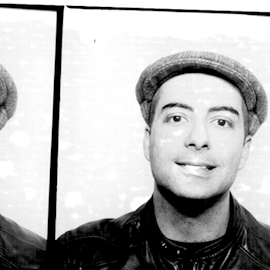

+++
date = "2015-10-06T22:44:09-04:00"
draft = true
title = "Welcome"

+++

Giovanni Luca Ciampaglia
========================

### About Me {#first-heading}

I am currently a postdoctoral fellow at the [Center for Complex Networks
and Systems Research](http://cnets.indiana.edu/) (CNetS), [Indiana
University Bloomington](http://iub.edu), working on information
diffusion in the group of [Filippo
Menczer](http://informatics.indiana.edu/fil/) and [Alessandro
Flammini](http://sites.google.com/site/aflammin/). I will be soon
joining the [IU Network Science Institute](http://iuni.iu.edu) as an
assistant research scientist.

I obtained my Ph.D. in [Informatics](http://www.inf.usi.ch) from
Università della Svizzera Italiana (also known as University of Lugano)
in December 2011. My research was supervised jointly by Luca Maria
Gambardella ([IDSIA](http://www.idsia.ch/%7Eluca/)), Alberto Vancheri
(co-advisor,
[SUPSI](http://www.supsi.ch/dti/strumenti/rubrica/dettaglio.5503.backLink.58b96214-2453-483c-9f5f-d122ec981907.html))
and Paolo Giordano (co-advisor, [Uni
Wien](http://plone.mat.univie.ac.at/people/details?memberid=975&is_guest=0)).

Before joining CNetS, I was previously research analyst contractor at
the [Wikimedia Foundation](https://wikimediafoundation.org/), working on
[editor engagement
issues](http://en.wikipedia.org/wiki/Wikipedia:Editor_engagement), and
research associate at the [Chair of sociology, in particular modeling
and simulation](http://www.soms.ethz.ch), at the [Swiss Federal
Institute of Technology](http://ethz.ch) (ETH) in Zürich.

My research is about collective social phenomena on the Internet, in
particular large-scale collaboration platforms such as Wikipedia. I am
also interested in other complex social phenomena such as emergence of
social norms, cultural dynamics. Prior to my Ph.D. studies I also worked
on models of urban growth. You can find more information in my
[curriculum vitae](docs/cvglc.pdf) and my [software developer
portfolio](docs/portfolioglc.pdf).

### Contact Information

-   ✉\
    School of Informatics and Computing\
    Indiana University Bloomington\
    919 E 10 St\
     Bloomington, IN 47408, USA
-   @\
    [gciampag (AT) indiana.edu](mailto:CAPSgciampagCAPS@indiana.eduCAPS)
    (remove the caps)
-   ✆ \
    1-812-855-7261

### News

**21 Jun. 2015**: Submit to the [Computational Social Science
2015](http://cssworkshop.oii.ox.ac.uk/) workshop! This is a satellite
event of the [2015 Conference on Complex
Systems](http://www.ccs2015.org/). Deadline: June 25. For more info, see
the [official website](http://cssworkshop.oii.ox.ac.uk/).

**16 Jun. 2015**: Press coverage for the work on computational fact
checking: [official press
release](http://news.indiana.edu/releases/iu/2015/06/computational-fact-checker.shtml),
[Il Sole 24
Ore](http://nova.ilsole24ore.com/progetti/il-vero-e-il-falso-tweet) (in
Italian), [VICE
Magazine](http://motherboard.vice.com/read/an-algorithm-for-fact-checking),
[Pacific
Standard](http://www.psmag.com/nature-and-technology/fact-checking-with-wikipedia-links).

**23 Aug. 2014**: I am co-organizing the [2014 Workshop on Computational
Social Science](http://cssworkshop.oii.ox.ac.uk/), a satellite event of
[ECCS'14](//eccs14.eu).

**18 Oct. 2013**: I am the publicity chair for the [ACM 2014 Conference
on Web Science](http://websci14.org).

**17-19 Sep. 2013**: I helped co-organize [COVEnANT
2013](http://covenant2013.com), a satellite events at the [European
Conference on Complex Systems](http://eccs13.eu).

**27 Sep. 2012**: Notabilia
[won](http://www.informationisbeautifulawards.com/2012-winners/) the
[Kantar Information is Beautiful Awards
2012](http://www.informationisbeautifulawards.com/) for “Best
Interactive Visualization”. The jury was composed of David McCandless
(informationisbeautiful.net), Brian Eno, Paola Antonelli (MoMA), Maria
Popova (brainpickings.org), and Simon Rogers (Twitter).

**02 Jul. 2012**: I am the recipient of an [SNF “Prospective Researcher”
fellowship](http://www.snf.ch/E/funding/individuals/prospective-researchers/Pages/default.aspx).
Thanks to the financial support of the Swiss National Science
Foundation, I will join the [Center for Complex Networks and Systems
Research](http://cnets.indiana.edu), Indiana University, in early 2013.

**12 Apr. 2012**: Last December I successfully defended my Ph.D. thesis.
The revised version is now online on this page. See below for the full
reference information. **UPDATE (24/04)**: The thesis is now available
on [RÉRO Doc](http://doc.rero.ch/record/28987?ln=en).

**10 Oct. 2011**: Notabilia has been included for exposition at the
[Adobe Museum of Digital Media](http://www.adobemuseum.com). You can
find it
[here](http://www.adobemuseum.com/#/exhibit/inform/notabiliaVisualizingDeletionDiscussionsOnWikipedia).
The exhibit curator is Thomas Goetz, Wired.

**01 Jul. 2011**: I will spend two months at the Community department of
the [Wikimedia Foundation](http://wikimediafoundation.org), [doing
research](http://meta.wikimedia.org/wiki/Research:WSOR11) on the
Wikipedia community.

**10 Jan. 2011**: [Notabilia](http://notabilia.net), a visualization of
the longest [AfD](http://en.wikipedia.org/wiki/Wikipedia:AFD)
discussions on the [English Wikipedia](http://en.wikipedia.org/), is now
public. Notabilia is a joint project with [Moritz
Stefaner](http://moritz.stefaner.eu/) (design and visualization) and
[Dario Taraborelli](http://nitens.org/) (data analysis and research).
Notabilia has been featured on the Dutch magazine [Bright
Magazine](images/bright_mag.png), German magazine
[Page](images/CheckMoritz.pdf), on visualization blogs
[Infosthetics](http://infosthetics.com/archives/2011/01/notabilia_revealing_the_discussions_on_the_deletion_of_wikipedia_articles.html)
and [Flowing
data](http://flowingdata.com/2011/01/11/visualizing-deletion-discussions-on-wikipedia/),
and on technology blogs such as [Boing
boing](http://www.boingboing.net/2011/01/11/visualizing-the-dele.html)
and many more. Go have a look at it and… after that don't forget to wish
Wikipedia happy birthday, [because it's turning
10](http://ten.wikipedia.org/wiki/Main_Page) soon!

**04 Jan. 2010**: I will be visiting [Dirk Helbing's group at ETH
Zurich](http://www.soms.ethz.ch) for the next three months!

**08-12 Jun. 2009**: Attended the *International Workshop on Coping with
Crises in Complex Socio-Economic Systems*
([website](http://www.soms.ethz.ch/workshop2009)), and presented my work
on opinion dynamics and wikis. Slides are
[here](docs/slides/ciampagliaCCSS09.pdf) in PDF format. A video of the
talks is also available on
[videolectures](http://videolectures.net/ccss09_ciampaglia_caciw/).

**01 Jul. 2008**: Attended the [Complex Systems Summer School
2008](http://tuvalu.santafe.edu/events/workshops/index.php/CSSS_2008_Santa_Fe)
at the [Santa Fe Institute!](http://www.santafe.edu) Pictures are on
[Picasa.](http://picasaweb.google.com/cssummerschool2008/)

### Publications

-   J. Park, G. L. Ciampaglia, E. Ferrara: Style in the age of Instagram
    -- Predicting success within the fashion industry using social
    media. *Proceedings of CSCW'16*
    [[pre-print](http://arxiv.org/abs/1508.04185)]
-   G. L. Ciampaglia, P. Shiralkar, L. M. Rocha, J. Bollen, F. Menczer,
    A. Flammini: Computational fact checking from knowledge networks.
    *PLOS ONE 10(6): e01289193*
    [[doi](http://journals.plos.org/plosone/article?id=10.1371/journal.pone.0128193)].
-   R. Fulper, G. L. Ciampaglia, E. Ferrara, F. Menczer, Y. Ahn, A.
    Flammini, B. Lewis, and K. Rowe: Misogynistic Language on Twier and
    Sexual Violence. *Proc. ACM Web Science Workshop on Computational
    Approaches to Social Modeling
    (ChASM)*[[doi](http://dx.doi.org/10.6084/m9.figshare.1291081)].
-   G. L. Ciampaglia, A. Flammini, F. Menczer: The production of
    information in the attention economy. *Scientific Reports*
    [[doi](http://www.nature.com/srep/2015/150514/srep09452/full/srep09452.html)].
-   G. L. Ciampaglia, D. Taraborelli. MoodBar: Increasing new user
    retention in Wikipedia through lightweight socialization.
    *Proceedings of CSCW'15*
    [[pre-print](http://arxiv.org/abs/1409.1496)].
-   G. L. Ciampaglia, S. Lozano, D. Helbing: Power and Fairness in a
    Generalized Ultimatum Game. *PLoS One, 2014*
    [[doi](http://www.plosone.org/article/info%3Adoi%2F10.1371%2Fjournal.pone.0099039),
    [ssrn](http://ssrn.com/abstract=2495498)]
-   G. L. Ciampaglia, S. Lozano, D. Helbing: Anonymous Sharing Behavior
    in Web Experiments with Different Balance of Power. *Quality
    Collectives: evolving socio-technical systems to support quality*
    [[ebook](http://www.qlectives.eu/quality-collectives-book),
    [ssrn](http://papers.ssrn.com/sol3/papers.cfm?abstract_id=2552202)]
-   G. L. Ciampaglia: A Framework for the Calibration of Social
    Simulation Models. *Advances in Complex Systems **16**, 1350030,
    2013* [[doi](http://dx.doi.org/10.1142/S0219525913500306),
    [pre-print](http://arxiv.org/abs/1305.3842)]
-   G. L. Ciampaglia: A Bounded Confidence Approach to Understanding
    User Participation in Peer Production Systems. *LNCS, 2011, Vol.
    6984, pp. 269-282, Springer.* [Paper:
    [doi](http://dx.doi.org/10.1007/978-3-642-24704-0_29),
    [pre-print](http://arxiv.org/abs/1107.5620), Slides:
    [pdf](docs/slides/CiampagliaSocInfo2011.pdf), (2.0 MB)]
-   D. Taraborelli and G. L. Ciampaglia: Beyond notability. Collective
    deliberation on content inclusion in Wikipedia. *In Fourth IEEE
    International Conference on Self-Adaptive and Self-Organizing
    Systems Workshops (SASOW 2010), Budapest, September 27-October 1
    2010.* [[doi](http://dx.doi.org/10.1109/SASOW.2010.26)]
-   G. L. Ciampaglia, A. Vancheri: Empirical Analysis of User
    Participation in Online Communities: the Case of Wikipedia. *In
    Proc. of 4th International AAAI Conference on Weblogs and Social
    Media (ICWSM 2010) May 23-26, 2010, George Washington University,
    Washington, DC*
    [[pdf](http://www.aaai.org/ocs/index.php/ICWSM/ICWSM10/paper/viewFile/1517/1861)]
-   G. L. Ciampaglia, B. Tirozzi. Go East: A residential land use model
    for the periphery of Rome. *Proceedings of iEMSs 2008: International
    Congress on Environmental Modelling and Software.* [Paper:
    [pdf](docs/papers/RomeModel2008.pdf), Slides:
    [pdf](docs/slides/slides_RomeModel2008.pdf) (9.1 MB)]
-   R. Rebiha, G. L. Ciampaglia: An Ant Colony Verification Algorithm.
    *Proceedings of the 7th International Conference on Intelligent
    Systems Design and Applications*
    [[pdf](docs/papers/RebihaACOVerification07.pdf)]

*These digital copies are provided here for archival reasons only. The
copyright of the respective publishers is acknowledged.*

### Theses & working papers

-   G. L. Ciampaglia. User Participation and Community Formation in Peer
    Production Systems. PhD thesis. University of Lugano, 2011.
    [[link](http://doc.rero.ch/record/28987?ln=en)]
-   A. Millner, G. L. Ciampaglia, N. Aravamudan, J. Foster: The cost of
    strategic adaptation in a simple conceptual model of climate change.
    *Working Paper for the Santa Fe Institute Complex Systems Summer
    School, 2008*
    [[pdf](http://www.santafe.edu/events/workshops/images/3/32/Simpleclimatechange.pdf)]
-   G. L. Ciampaglia. *Modello di Crescita Urbana Mediante Automi
    Cellulari e Sistemi Multi-Agente.* Tesi di Laurea in Informatica,
    Università degli Studi di Roma "La Sapienza", 2006. (In Italian)
    [[pdf](docs/papers/tesi_giovanni.pdf)]

### Teaching

Taught [851-0585-04L — Lecture with Computer Exercises: Modelling and
Simulating Social Systems with
MATLAB](http://www.vvz.ethz.ch/Vorlesungsverzeichnis/lerneinheitPre.do?lerneinheitId=68029&semkez=2010W&lang=en)
at ETH Zürich during the fall semester 2010/11

Assisted [Luca Maria Gambardella](http://www.idsia.ch/%7Eluca) for the
course "Information and Knowledge Management I - AI" during the spring
semester 07/08. The course's page is
[here](http://corsi.elearninglab.org/course/view.php?id=2238).

Assisted [Antonio Carzaniga](http://www.inf.usi.ch/carzaniga/) for the
[Computer
Networking](http://www.inf.usi.ch/faculty/carzaniga/edu/ntw/index.html)
course during the spring semester 06/07.

### Links, Friends & Past Affiliations

The [Neural networks and asymptotic analysis
group](http://pamina.phys.uniroma1.it), at the Physics Department,
University of Rome, where I did my master thesis.

My musical [profile](http://www.last.fm/user/junkieDolphin/) on
[Last.fm](http://www.last.fm).

* * * * *

-   Last updated:
-   ©
    Giovanni Luca Ciampaglia.
-   Validate: [markup](http://validator.w3.org/check/referer),
    [css](http://jigsaw.w3.org/css-validator/check/referer),
    [links](http://validator.w3.org/checklink?uri=%s).
-   
